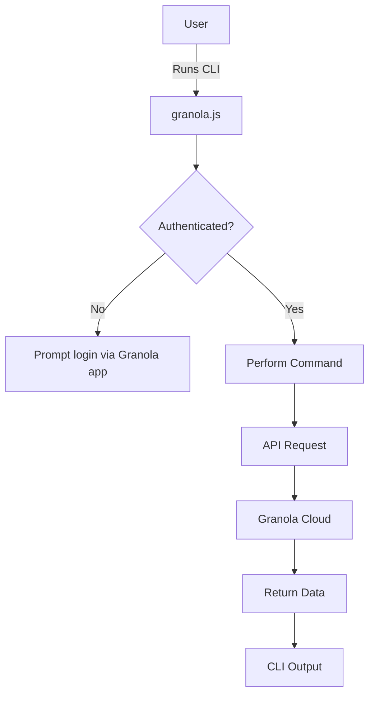

# Granola CLI

A terminal-based CLI tool for interacting with Granola notes and folders. The CLI enables you to list, search, and create notes from the command line.

## Features

- List all folders: [`granola folders`](src/commands/folders.ts:9)
- List/search/filter notes: [`granola notes`](src/commands/notes.ts:9)
  - Options: `--title`, `--date`, `--content`, `--folder`
- Show note details and AI summary: [`granola note <id>`](src/commands/note.ts:10)
  - Options: `--transcript-only`, `--summary-only`, `--raw`
- Export note content as markdown: [`granola export <id>`](src/commands/export.ts:12)
  - Options: `--transcript`, `--all`, `--raw`, `--output <directory>`
- Create a new note: [`granola create`](src/commands/create.ts:7)
- API authentication via local Granola desktop app
- Docker support for containerized usage
- Devcontainer for VS Code development

## Getting Started

Choose your preferred setup method:

### Option 1: Local Installation (Node.js)

**Prerequisites:**

- Node.js 20+
- Granola desktop app (for authentication)

**Steps:**

```bash
git clone <repo-url>
cd granola-cli
npm install
npm run setup     # Builds and links CLI globally
```

**Verification:**

```bash
granola --version
granola --help
```

### Option 2: Docker Compose (Recommended for containers)

**Prerequisites:**

- Docker and Docker Compose
- Granola desktop app (for authentication)

**Development:**

```bash
git clone <repo-url>
cd granola-cli
docker compose up --build
```

**Production:**

```bash
docker compose --profile production up --build -d
```

**Run commands:**

```bash
# Development
COMPOSE_PROFILE=development docker compose exec granola-cli-dev granola folders
COMPOSE_PROFILE=development docker compose exec granola-cli-dev granola notes

# Production  
COMPOSE_PROFILE=production docker compose exec granola-cli-prod granola folders
```

### Option 3: VS Code DevContainer (Recommended for development)

**Prerequisites:**

- VS Code + Dev Containers extension + Docker Desktop

**Steps:**

1. Open project in VS Code: `code .`
2. Click "Reopen in Container" when prompted
3. CLI is automatically set up and ready to use

**Features:**

- 🔧 Complete development toolchain (TypeScript, ESLint, Prettier)
- 🐚 Enhanced terminal (Zsh + Oh My Zsh)
- ⚡ Fast rebuilds with Docker layer caching
- 🔒 Isolated environment

**Features include complete development toolchain with enhanced terminal experience.**

## Usage

### Authentication

The CLI automatically reads your access token from the Granola desktop app configuration. The token is read dynamically to handle automatic rotation (tokens refresh every ~24 hours).

**macOS Path:** `~/Library/Application Support/Granola/supabase.json`

**Custom Config Path (optional):**

```bash
export GRANOLA_CONFIG_PATH="/path/to/supabase.json"
```

**📖 For container setup details, see:** [`AUTHENTICATION.md`](AUTHENTICATION.md)

### Commands & Examples

**List folders:**

```bash
granola folders
```

**List/search/filter notes:**

```bash
granola notes
granola notes --title "meeting"
granola notes --date 2025-07-01
granola notes --content "project"
granola notes --folder abc123
```

**Show note details and AI summary:**

```bash
granola note note1                    # Show metadata + AI summary (default)
granola note note1 --transcript-only # Show metadata + transcript only
granola note note1 --summary-only    # Show metadata + AI summary only
granola note note1 --raw             # Show raw content without formatting
```

**Export note content as markdown:**

```bash
granola export note1                      # Export AI summary as markdown (default)
granola export note1 --transcript         # Export transcript as markdown
granola export note1 --all                # Export both summary and transcript
granola export note1 --raw                # Export raw content without formatting
granola export note1 --output ./my-notes  # Export to custom directory
```

**Create a new note:**

```bash
granola create
```

## Development

### Local Development (without containers)

```bash
npm install
npm run dev        # Watch mode for development
npm run build      # Compile TypeScript
npm run start      # Run the compiled CLI
```

### Docker Development

**Manual Docker commands:**

```bash
docker build -t granola-cli .
docker run --rm -it \
  -v "$HOME/Library/Application Support/Granola:/granola-config:ro" \
  granola-cli folders
```

**Using npm scripts:**

```bash
# Development
npm run docker:dev

# Production
npm run docker:prod

# Stop containers
npm run docker:stop

# View logs
npm run docker:logs

# Access shell
npm run docker:shell
```

## Commands Reference

| Command               | Description                                     | Options/Arguments                                                 |
| --------------------- | ----------------------------------------------- | ----------------------------------------------------------------- |
| `granola folders`     | List all folders                                | None                                                              |
| `granola notes`       | List/search/filter notes                        | `--title`, `--date`, `--content`, `--folder`                      |
| `granola note <id>`   | Show details and AI summary for a specific note | `<id>` (required), `--transcript-only`, `--summary-only`, `--raw` |
| `granola export <id>` | Export note content as markdown                 | `<id>` (required), `--transcript`, `--all`, `--raw`, `--output <directory>` |
| `granola create`      | Create a new note (opens Granola app)           | None                                                              |

## Troubleshooting

### CLI Setup Issues

**Command not found:**

1. Run `npm run setup` to re-link the CLI
2. Check if build was successful with `npm run build`
3. Verify npm link worked with `which granola`

**Permission errors:**

- Use `sudo npm link` or run the provided setup scripts
- The setup scripts handle permissions automatically

**Container issues:**

- **DevContainer**: Rebuild container to trigger `postCreateCommand`
- **Production**: Rebuild Docker image to ensure `npm link` runs

### Authentication Issues

**"Not authenticated" error:**

- Run `./scripts/get-granola-token.sh` on your host machine to get your token
- Set `GRANOLA_ACCESS_TOKEN` environment variable
- Ensure Granola desktop app is running and you are logged in

**Container authentication:**

- Use environment variable: `GRANOLA_ACCESS_TOKEN="your_token"`
- Or mount config directory with correct paths for your OS

**📖 Detailed troubleshooting:** [`AUTHENTICATION.md`](AUTHENTICATION.md)

## Project Structure



## Related Documentation

- [`AUTHENTICATION.md`](AUTHENTICATION.md) - Complete authentication guide
- [`DEPLOYMENT.md`](DEPLOYMENT.md) - Docker deployment and production setup
- [`.devcontainer/README.md`](.devcontainer/README.md) - DevContainer setup and troubleshooting

## Credits

This project was heavily inspired by the [Granola Raycast extension](https://github.com/raycast/extensions/tree/70d758e3b7a7e50e301b7661f4bfe9b6855184fa/extensions/granola) and aims to provide a similar experience in the terminal.
